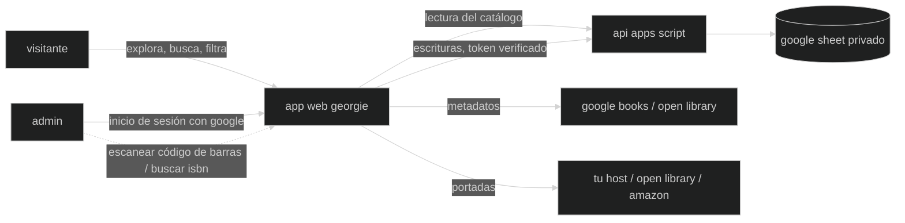

🇬🇧 [English](README.md) · 🇮🇹 [Italiano](README.it.md) · 🇪🇸 Español

# georgie

una aplicación web para gestionar nuestra biblioteca física de casa — explorar, catalogar, prestar e intercambiar los libros de nuestros estantes.

**georgie** era el apodo familiar de jorge luis borges, heredado del lado inglés de su familia. antes de ser el escritor que imaginó el paraíso como una especie de biblioteca, fue un niño llamado georgie que creció recorriendo la biblioteca de su padre en buenos aires — el lugar que mitificaría por el resto de su vida, y al que finalmente regresaría como director de la biblioteca nacional de argentina. este proyecto toma prestado su apodo para una biblioteca mucho más pequeña: la de casa.

> en vivo en [georgie.leandroestrella.com](https://georgie.leandroestrella.com/)

## ¿cómo funciona?

el catálogo vive en un google sheet. una aplicación web estática lo lee y lo muestra públicamente; los admin inician sesión con google para hacer cambios, que pasan por una api de google apps script de vuelta a la hoja.



## funcionalidades

- 📚 catálogo público, de solo lectura — búsqueda instantánea; filtra por zona, tema, autor, propietario, idioma, leído por y estado; ordena por título, autor o año; vistas de tarjetas y de tabla, ambas responsive hasta el teléfono
- 🔎 detalles del libro obtenidos de la web por isbn (google books → open library), completando solo los campos vacíos; búsqueda por título y autor con selección de candidatos para libros sin isbn
- 📷 **escaneo de código de barras** — apunta la cámara del teléfono al código de barras de la contraportada (el ean-13 *es* el isbn) para buscar un libro; nativo en android, con un decodificador que se carga bajo demanda en ios
- 🖼 portadas con una cadena de respaldo: url guardada → open library → amazon por isbn-10 → un marcador de posición teñido según la zona; los admin pueden fijar la portada mostrada — o tomar una foto del libro — en su propio host para que nunca se pierda
- ✏️ inicio de sesión admin para añadir, editar, archivar (eliminación suave, con una vista de archivados + restauración) y prestar libros
- 🧹 un filtro "por completar" (año faltante, `circa`, sin portada, sin idioma original) — la herramienta para terminar el catálogo desde el estante
- 🤝 seguimiento de préstamos — presta un libro (quién lo tiene + fecha), márcalo como devuelto; marca de intercambio para libros ofrecidos en plataformas de intercambio de libros
- 🗂 categorías guiadas por la propia hoja: zonas (con sus propios colores, y emoji o imágenes como marcadores) que agrupan temas, reflejando los estantes físicos; las insignias de propietario y lector también vienen de la hoja
- 🌍 interfaz en english, italiano y español (los nombres de zonas/temas/idiomas y las descripciones de zonas y temas también se traducen)
- 🪪 ids legibles con formato de número de catálogo (`ORW-198-1950`), generados una sola vez e inmutables
- 📊 una página de **estadísticas** solo para admin — libros por zona (con el desglose de los temas de cada zona), por idioma, en idioma original vs. traducidos, y estadísticas de lectura por usuario; cada dato enlaza a la vista filtrada correspondiente del catálogo
- 🕘 un **registro de actividad** solo para admin — cada alta, edición, archivado, restauración, préstamo y devolución, del más reciente al más antiguo, con quién lo hizo, qué cambió, y un enlace al libro
- 📖 una página **acerca de** dentro de la app — el readme del proyecto, mostrada desde el avatar de georgie — con un pie de página que enlaza al código fuente y al autor

## stack tecnológico

- [vite](https://vitejs.dev/) + [react](https://react.dev/) + [typescript](https://www.typescriptlang.org/) — frontend estático
- [tailwind css](https://tailwindcss.com/) + [shadcn/ui](https://ui.shadcn.com/) — estilos y componentes
- [react-router](https://reactrouter.com/) — enrutamiento del lado del cliente
- [react-i18next](https://react.i18next.com/) — internacionalización (english / italiano / español)
- [zxing-wasm](https://github.com/Sec-ant/zxing-wasm) — escaneo de códigos de barras, con el `BarcodeDetector` nativo del navegador cuando está disponible
- [google apps script](https://developers.google.com/apps-script) + [clasp](https://github.com/google/clasp) — api de backend vinculada a la hoja
- [google identity services](https://developers.google.com/identity) — inicio de sesión admin
- [google sheets](https://www.google.com/sheets/about/) — la base de datos
- [ftp-deploy-action](https://github.com/SamKirkland/FTP-Deploy-Action) — despliega a cpanel en cada push a `master`

## estructura del repositorio

```
web/          la spa (vite + react)
apps-script/  la api de backend (sincronizada con clasp)
cpanel/       endpoint php opcional para alojar portadas en tu propio servidor
docs/         guías para quien gestiona el catálogo (ids de libros, marcadores de la hoja, traducciones)
assets/       material gráfico de la marca
```

## ejecuta tu propia instancia

georgie es una plantilla para cualquiera que quiera catalogar sus propios estantes:

1. copia la plantilla de google sheet — una pestaña `Catalog` con las columnas de los libros, una pestaña `Zones` que define tus categorías, y una pestaña `Lists` para propietarios/idiomas (los encabezados de columna exactos están en [docs/sheet-setup.md](docs/sheet-setup.md)). mantenla **privada** (la app la lee a través del backend, así que nunca necesita compartirse por enlace)
2. crea un apps script vinculado a tu hoja: `cd apps-script`, `npm install`, `npx clasp login`, luego `clasp clone <scriptId>` (o crea el proyecto desde Extensions → Apps Script de la hoja y `clasp push`). despliégalo como aplicación web ("execute as: me", "who has access: anyone"). ejecuta cualquier función una vez desde el editor para conceder los scopes (hoja de cálculo + solicitudes externas), pasando por la pantalla de consentimiento
3. crea un google oauth client id (aplicación web) para el botón de inicio de sesión; añade el origen de tu sitio a sus authorized javascript origins
4. configura los admin y el client id en el backend:
   - ejecuta `setupUsersTab` desde el editor de apps script — crea una pestaña `Users` y te añade como primer admin; añade cada admin como una fila (`Email`, `Owner`). esta pestaña es la lista de quién puede escribir, y sus valores `Owner` son también las personas de las que la página de estadísticas informa datos de lectura — escribe cada nombre exactamente como aparece en las columnas `Owner` / `Read by` del catálogo (la comparación distingue mayúsculas y minúsculas)
   - añade una script property `OAUTH_CLIENT_ID` (Project Settings → Script Properties) con el client id del paso 3, para que el backend pueda verificar los tokens de inicio de sesión
5. copia `web/.env.example` a `web/.env.local` y completa `VITE_API_URL` (tu url `/exec`) y `VITE_GOOGLE_CLIENT_ID` — ambos son públicos, así que también pueden vivir en los secrets del repositorio de github para la acción de despliegue
6. `npm install && npm run build` en `web/`, y aloja la carpeta `dist/` donde sea que tengas hosting estático (se incluye un `.htaccess` para el enrutamiento spa + cabeceras básicas para apache/cpanel)
7. *(opcional)* para permitir que los admin guarden portadas en tu propio host, copia [`cpanel/upload-cover.php`](cpanel/upload-cover.php) en el servidor y añade las script properties `COVERS_UPLOAD_URL` / `COVERS_UPLOAD_SECRET` — ver [cpanel/README.md](cpanel/README.md)

ambos valores de configuración son seguros de publicar (el client id de oauth es público por diseño, y cada escritura está protegida del lado del servidor mediante la verificación del id-token de google contra la lista `Users`) — ningún secreto llega jamás al repositorio.

## guías para quien gestiona el catálogo

las guías del día a día para gestionar tu catálogo viven en [`docs/`](docs/):

- [configuración de la hoja](docs/sheet-setup.md) — el esquema exacto de columnas de `Catalog` / `Zones` / `Lists`
- [ids de los libros](docs/book-ids.md) — cómo se generan los ids con formato de número de catálogo, `=MAKEID`, y el raro caso de regeneración manual
- [marcadores](docs/markers.md) — las insignias de propietario/lector/zona guiadas por columnas de la hoja
- [traducciones](docs/translations.md) — traducir nombres y descripciones de zonas/temas, y nombres de idiomas
- [alojamiento de portadas](cpanel/README.md) — el endpoint opcional para alojar portadas en tu propio servidor

## desarrollo

el trabajo ocurre en la rama `develop`; el merge a `master` dispara la build y el despliegue ftp a cpanel vía github actions.

```bash
cd web
npm install
npm run dev     # funciona con datos simulados hasta que se configure VITE_API_URL — no necesita backend
npm test        # vitest (lógica pura: ids, mapeo, filtros, validación, metadatos)
npm run build   # verificación de tipos + build de producción
```

la lógica pura (generación de ids, mapeo de columnas, análisis de la taxonomía) se mantiene
independiente del framework para poder probarla sin una hoja en vivo; el backend de apps script
tiene su propio `npm test` (`node --test`).

## licencia

[apache 2.0](LICENSE)
