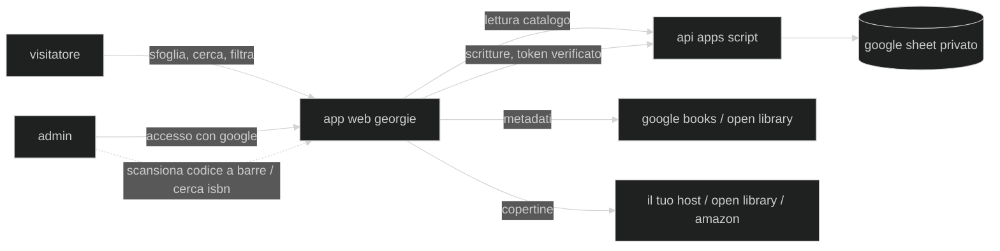

🇬🇧 [English](README.md) · 🇮🇹 Italiano · 🇪🇸 [Español](README.es.md)

# georgie

un'app web per gestire la nostra biblioteca fisica di casa — sfogliare, catalogare, prestare e scambiare i libri sugli scaffali.

**georgie** era il soprannome di famiglia di jorge luis borges, ereditato dal lato inglese della sua famiglia. prima di essere lo scrittore che immaginò il paradiso come una specie di biblioteca, era un bambino chiamato georgie che crebbe girovagando per la biblioteca di suo padre a buenos aires — il luogo che avrebbe mitizzato per il resto della sua vita, e al quale sarebbe infine tornato come direttore della biblioteca nazionale argentina. questo progetto prende in prestito il suo soprannome per una biblioteca molto più piccola: quella di casa.

> live su [georgie.leandroestrella.com](https://georgie.leandroestrella.com/)

## come funziona?

il catalogo vive in un google sheet. un'app web statica lo legge e lo mostra pubblicamente; gli admin accedono con google per apportare modifiche, che passano attraverso una api google apps script per tornare nel foglio.



## funzionalità

- 📚 catalogo pubblico, di sola lettura — ricerca istantanea; filtra per zona, tema, autore, proprietario, lingua, letto da e stato; ordina per titolo, autore o anno; viste a schede e a tabella, entrambe responsive fino al telefono
- 🔎 dettagli del libro recuperati dal web tramite isbn (google books → open library), riempiendo solo i campi vuoti; ricerca per titolo e autore con selezione tra i candidati per i libri senza isbn
- 📷 **scansione codice a barre** — punta la fotocamera del telefono sul codice a barre in quarta di copertina (l'ean-13 *è* l'isbn) per cercare un libro; nativa su android, con un decoder caricato al bisogno su ios
- 🖼 copertine con una catena di fallback: url salvato → open library → amazon per isbn-10 → un segnaposto colorato secondo la zona; gli admin possono fissare la copertina mostrata — o scattare una foto del libro — sul proprio host, così non scompare mai
- ✏️ accesso admin per aggiungere, modificare, archiviare (eliminazione soft, con una vista archiviati + ripristino) e prestare libri
- 🧹 un filtro "da completare" (anno mancante, `circa`, senza copertina, senza lingua originale) — lo strumento per completare il catalogo direttamente dallo scaffale
- 🤝 tracciamento dei prestiti — presta un libro (chi lo prende + data), segnalo reso; flag di scambio per i libri offerti su piattaforme di scambio libri
- 🗂 categorie guidate dal foglio stesso: zone (con i propri colori, ed emoji o immagini come marcatori) che raggruppano i temi, rispecchiando gli scaffali fisici; anche i badge di proprietario e lettore vengono dal foglio
- 🌍 interfaccia in english, italiano ed español (si traducono anche i nomi di zone/temi/lingue e le descrizioni di zone e temi)
- 🪪 id leggibili in stile numero di catalogo (`ORW-198-1950`), generati una sola volta e immutabili
- 📊 una pagina **statistiche** riservata agli admin — libri per zona (con il dettaglio dei temi di ogni zona), per lingua, in lingua originale vs tradotti, e statistiche di lettura per utente; ogni dato rimanda alla vista filtrata corrispondente del catalogo
- 🕰️ un **registro attività** riservato agli admin — ogni aggiunta, modifica, archiviazione, ripristino, prestito e reso, dal più recente, con chi l'ha fatto, cosa è cambiato, e un link al libro
- 📖 una pagina **info** nell'app — il readme del progetto, mostrata a partire dall'avatar di georgie — con un footer che rimanda al codice sorgente e all'autore

## stack tecnologico

- [vite](https://vitejs.dev/) + [react](https://react.dev/) + [typescript](https://www.typescriptlang.org/) — frontend statico
- [tailwind css](https://tailwindcss.com/) + [shadcn/ui](https://ui.shadcn.com/) — stile e componenti
- [react-router](https://reactrouter.com/) — routing lato client
- [react-i18next](https://react.i18next.com/) — internazionalizzazione (english / italiano / español)
- [zxing-wasm](https://github.com/Sec-ant/zxing-wasm) — scansione codici a barre, con il `BarcodeDetector` nativo del browser quando disponibile
- [google apps script](https://developers.google.com/apps-script) + [clasp](https://github.com/google/clasp) — api di backend collegata al foglio
- [google identity services](https://developers.google.com/identity) — accesso admin
- [google sheets](https://www.google.com/sheets/about/) — il database
- [ftp-deploy-action](https://github.com/SamKirkland/FTP-Deploy-Action) — deploy su cpanel a ogni push su `master`

## struttura del repository

```
web/          la spa (vite + react)
apps-script/  l'api di backend (sincronizzata con clasp)
cpanel/       endpoint php opzionale per ospitare le copertine sul proprio server
docs/         guide per chi gestisce il catalogo (id dei libri, marcatori del foglio, traduzioni)
assets/       materiale grafico del brand
```

## avvia la tua istanza

georgie è un template per chiunque voglia catalogare i propri scaffali:

1. copia il template del google sheet — una scheda `Catalog` con le colonne dei libri, una scheda `Zones` che definisce le tue categorie, e una scheda `Lists` per proprietari/lingue (le intestazioni di colonna esatte sono in [docs/sheet-setup.md](docs/sheet-setup.md)). tienilo **privato** (l'app lo legge tramite il backend, quindi non deve mai essere condiviso via link)
2. crea un apps script collegato al tuo foglio: `cd apps-script`, `npm install`, `npx clasp login`, poi `clasp clone <scriptId>` (oppure crea il progetto tramite Extensions → Apps Script del foglio e `clasp push`). distribuiscilo come app web ("esegui come: me", "chi ha accesso: chiunque"). esegui una qualsiasi funzione una volta dall'editor per concedere gli scope (foglio di calcolo + richieste esterne), passando per la schermata di consenso
3. crea un google oauth client id (applicazione web) per il pulsante di accesso; aggiungi l'origine del tuo sito alle sue authorized javascript origins
4. configura gli admin e il client id sul backend:
   - esegui `setupUsersTab` dall'editor di apps script — crea una scheda `Users` e ti aggiunge come primo admin; aggiungi ogni admin come riga (`Email`, `Owner`). questa scheda è la lista di chi può scrivere, e i suoi valori `Owner` sono anche le persone di cui la pagina statistiche riporta i dati di lettura — scrivi ciascun nome esattamente come appare nelle colonne `Owner` / `Read by` del catalogo (il confronto distingue maiuscole e minuscole)
   - aggiungi una script property `OAUTH_CLIENT_ID` (Project Settings → Script Properties) con il client id del punto 3, così il backend può verificare i token di accesso
5. copia `web/.env.example` in `web/.env.local` e compila `VITE_API_URL` (il tuo url `/exec`) e `VITE_GOOGLE_CLIENT_ID` — sono entrambi pubblici, quindi possono anche vivere nei repo secrets di github per l'azione di deploy
6. `npm install && npm run build` in `web/`, e ospita la cartella `dist/` ovunque tu abbia hosting statico (è incluso un `.htaccess` per il routing spa + header di base per apache/cpanel)
7. *(opzionale)* per permettere agli admin di salvare le copertine sul tuo host, copia [`cpanel/upload-cover.php`](cpanel/upload-cover.php) sul server e aggiungi le script property `COVERS_UPLOAD_URL` / `COVERS_UPLOAD_SECRET` — vedi [cpanel/README.md](cpanel/README.md)

entrambi i valori di configurazione sono sicuri da pubblicare (il client id oauth è pubblico per design, e ogni scrittura è protetta lato server dalla verifica del token id google rispetto alla lista `Users`) — nessun segreto finisce mai nel repository.

## guide per chi gestisce il catalogo

le guide pratiche per la gestione quotidiana del catalogo vivono in [`docs/`](docs/):

- [impostazione del foglio](docs/sheet-setup.md) — lo schema esatto delle colonne `Catalog` / `Zones` / `Lists`
- [id dei libri](docs/book-ids.md) — come vengono generati gli id in stile numero di catalogo, `=MAKEID`, e il raro caso di rigenerazione manuale
- [marcatori](docs/markers.md) — i badge di proprietario/lettore/zona guidati dalle colonne del foglio
- [traduzioni](docs/translations.md) — tradurre nomi e descrizioni di zone/temi, e nomi delle lingue
- [hosting delle copertine](cpanel/README.md) — l'endpoint opzionale per ospitare le copertine sul proprio server

## sviluppo

il lavoro avviene sul branch `develop`; il merge su `master` avvia la build e il deploy ftp su cpanel tramite github actions.

```bash
cd web
npm install
npm run dev     # gira su dati mock finché VITE_API_URL non è impostata — non serve un backend
npm test        # vitest (logica pura: id, mapping, filtri, validazione, metadati)
npm run build   # controllo dei tipi + build di produzione
```

la logica pura (generazione degli id, mapping delle colonne, parsing della tassonomia) è tenuta
priva di dipendenze dal framework, così da poter essere testata senza un foglio live; il backend
apps script ha il suo `npm test` (`node --test`).

## licenza

[apache 2.0](LICENSE)
