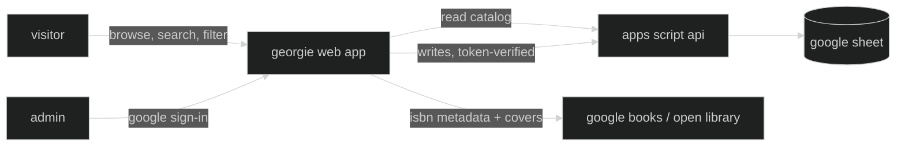

# georgie

a web app for managing our physical home library — browsing, cataloguing, lending, and exchanging the books on our shelves.

**georgie** was the family nickname of jorge luis borges, inherited from the english side of his family. before he was the writer who imagined paradise as a kind of library, he was a boy called georgie who grew up roaming his father's library in buenos aires — the place he would mythologize for the rest of his life, and to which he eventually returned as director of argentina's national library. this project borrows his nickname for a much smaller library: the one at home.

> live at [georgie.leandroestrella.com](https://georgie.leandroestrella.com/)

> 🚧 under construction — see [PLAN.md](PLAN.md) for the implementation plan.

## how it works?

the catalog lives in a google sheet. a static web app reads and displays it publicly; admins sign in with google to make changes, which flow through a google apps script api back into the sheet.



## features

- 📚 public, read-only catalog — search, filter and sort by zone, theme, owner, language and more
- 🔎 book details fetched from the web by isbn (google books + open library), covers included
- ✏️ admin sign-in to add, edit and archive books
- 🤝 loan tracking — flag a book as borrowed, by whom and since when
- 🔁 exchange flag for books offered on book-exchange platforms
- 🗂 categories driven by the sheet itself: zones (with their own colors) grouping themes, mirroring the physical shelves
- 🌍 interface in english, italiano and español
- 🪪 human-readable call-number ids (`ORW-198-1950`)

## tech stack

- [vite](https://vitejs.dev/) + [react](https://react.dev/) + [typescript](https://www.typescriptlang.org/) — static frontend
- [tailwind css](https://tailwindcss.com/) + [shadcn/ui](https://ui.shadcn.com/) — styling and components
- [react-i18next](https://react.i18next.com/) — internationalization
- [google apps script](https://developers.google.com/apps-script) + [clasp](https://github.com/google/clasp) — backend api bound to the sheet
- [google identity services](https://developers.google.com/identity) — admin sign-in
- [google sheets](https://www.google.com/sheets/about/) — the database
- [ftp-deploy-action](https://github.com/SamKirkland/FTP-Deploy-Action) — deploys to cpanel on push to `master`

## repository layout

```
web/          the spa (vite + react)
apps-script/  the backend api (synced with clasp)
```

## run your own instance

georgie is a template for anyone who wants to catalog their own shelves:

1. copy the google sheet template (a `Catalog` tab with the book columns, a `Zones` tab defining your categories)
2. create a bound apps script on your sheet, push the code in `apps-script/` with clasp, and deploy it as a web app ("execute as: me", "access: anyone")
3. create a google oauth client id for the sign-in button
4. set your admin emails in the script properties
5. configure `web/src/config.ts` with your `/exec` url and client id
6. `npm install && npm run build` in `web/`, and host the `dist/` folder anywhere static files live

detailed setup instructions will land here as the build progresses.

## development

work happens on the `develop` branch; merging to `master` triggers the build and ftp deploy to cpanel via github actions.

```bash
cd web
npm install
npm run dev
```

## license

[apache 2.0](LICENSE)
