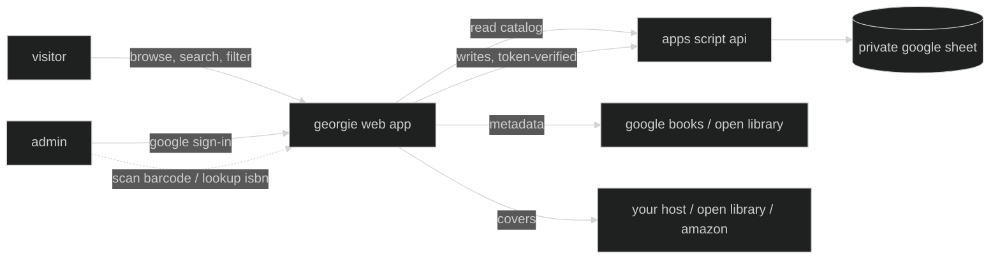

# georgie

a web app for managing our physical home library — browsing, cataloguing, lending, and exchanging the books on our shelves.

**georgie** was the family nickname of jorge luis borges, inherited from the english side of his family. before he was the writer who imagined paradise as a kind of library, he was a boy called georgie who grew up roaming his father's library in buenos aires — the place he would mythologize for the rest of his life, and to which he eventually returned as director of argentina's national library. this project borrows his nickname for a much smaller library: the one at home.

> live at [georgie.leandroestrella.com](https://georgie.leandroestrella.com/)

> see [PLAN.md](PLAN.md) for the full design and decisions.

## how it works?

the catalog lives in a google sheet. a static web app reads and displays it publicly; admins sign in with google to make changes, which flow through a google apps script api back into the sheet.



## features

- 📚 public, read-only catalog — instant search, filter and sort by zone, theme, author, owner, language, read-by and status; card and table views, both responsive down to a phone
- 🔎 book details fetched from the web by isbn (google books → open library), only filling empty fields; title/author search with a candidate picker for books with no isbn
- 📷 **barcode scanning** — point a phone camera at the back-cover barcode (the ean-13 *is* the isbn) to look a book up; native on android, a lazy-loaded decoder on ios
- 🖼 covers with a fallback chain: stored url → open library → amazon by isbn-10 → a zone-tinted placeholder; admins can pin the shown cover — or snap a photo of the book — to your own host so it never rots
- ✏️ admin sign-in to add, edit, archive (soft-delete, with an archived view + restore) and lend books
- 🧹 a "needs attention" filter (missing year, `circa`, no cover, no original language) — the tool for finishing the catalog from the shelf
- 🤝 loan tracking — lend a book (borrower + date), return it; exchange flag for books offered on book-exchange platforms
- 🗂 categories driven by the sheet itself: zones (with their own colors, and emoji or image markers) grouping themes, mirroring the physical shelves; owner and reader badges come from the sheet too
- 🌍 interface in english, italiano and español (zone/theme/language names and per-zone descriptions translate too)
- 🪪 human-readable call-number ids (`ORW-198-1950`), generated once and immutable

## tech stack

- [vite](https://vitejs.dev/) + [react](https://react.dev/) + [typescript](https://www.typescriptlang.org/) — static frontend
- [tailwind css](https://tailwindcss.com/) + [shadcn/ui](https://ui.shadcn.com/) — styling and components
- [react-router](https://reactrouter.com/) — client-side routing
- [react-i18next](https://react.i18next.com/) — internationalization (english / italiano / español)
- [zxing-wasm](https://github.com/Sec-ant/zxing-wasm) — barcode scanning, with the browser's native `BarcodeDetector` when available
- [google apps script](https://developers.google.com/apps-script) + [clasp](https://github.com/google/clasp) — backend api bound to the sheet
- [google identity services](https://developers.google.com/identity) — admin sign-in
- [google sheets](https://www.google.com/sheets/about/) — the database
- [ftp-deploy-action](https://github.com/SamKirkland/FTP-Deploy-Action) — deploys to cpanel on push to `master`

## repository layout

```
web/          the spa (vite + react)
apps-script/  the backend api (synced with clasp)
cpanel/       optional php endpoint for hosting covers on your own server
```

## run your own instance

georgie is a template for anyone who wants to catalog their own shelves:

1. copy the google sheet template — a `Catalog` tab with the book columns (see [PLAN.md §1](PLAN.md)), a `Zones` tab defining your categories, and a `Lists` tab for owners/languages. keep it **private** (the app reads it through the backend, so it never needs to be link-shared)
2. create a bound apps script on your sheet: `cd apps-script`, `npm install`, `npx clasp login`, then `clasp clone <scriptId>` (or create the project via the sheet's Extensions → Apps Script and `clasp push`). deploy it as a web app ("execute as: me", "who has access: anyone"). run any function once from the editor to grant the scopes (spreadsheet + external requests), clicking through the consent screen
3. create a google oauth client id (web application) for the sign-in button; add your site's origin to its authorized javascript origins
4. configure admins & the client id on the backend:
   - run `setupUsersTab` from the apps script editor — it creates a `Users` tab and seeds you; add each admin as a row (`Email`, `Owner`). this tab is the write allowlist
   - add a script property `OAUTH_CLIENT_ID` (Project Settings → Script Properties) with the client id from step 3, so the backend can verify sign-in tokens
5. copy `web/.env.example` to `web/.env.local` and fill in `VITE_API_URL` (your `/exec` url) and `VITE_GOOGLE_CLIENT_ID` — both are public, so they can also live in github repo secrets for the deploy action
6. `npm install && npm run build` in `web/`, and host the `dist/` folder anywhere static files live (an `.htaccess` for spa routing + basic headers is included for apache/cpanel)
7. *(optional)* to let admins save covers to your own host, drop [`cpanel/upload-cover.php`](cpanel/upload-cover.php) on the server and add the `COVERS_UPLOAD_URL` / `COVERS_UPLOAD_SECRET` script properties — see [cpanel/README.md](cpanel/README.md)

both config values are safe to publish (the oauth client id is public by design, and every write is gated server-side by google id-token verification against the `Users` allowlist) — nothing secret ever lands in the repo.

## development

work happens on the `develop` branch; merging to `master` triggers the build and ftp deploy to cpanel via github actions.

```bash
cd web
npm install
npm run dev     # runs on mock fixtures until VITE_API_URL is set — no backend needed
npm test        # vitest (pure logic: ids, mapping, filters, validation, metadata)
npm run build   # typecheck + production build
```

pure logic (id generation, column mapping, taxonomy parsing) is kept
framework-free so it's unit-tested without a live sheet; the apps script backend
has its own `npm test` (`node --test`).

## license

[apache 2.0](LICENSE)
